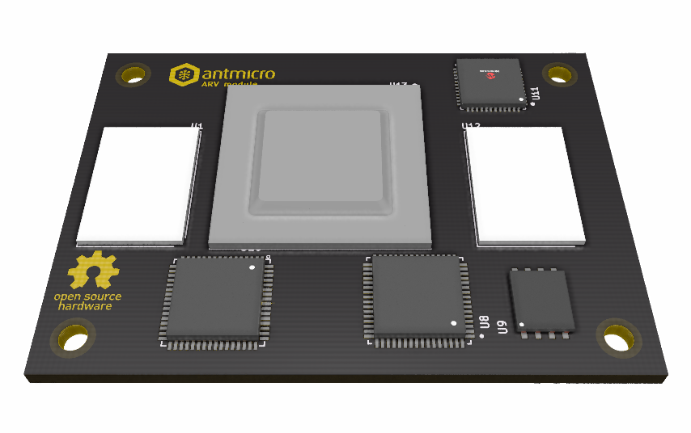

====================
ARV System on Module
====================

Copyright (c) 2021 `Antmicro <https://www.antmicro.com>`_

Overview
--------

This repository contains open hardware design files for an ARV system on module.
The main purpose of this platform is to to asses feasibility of making a custom SoM that will be pin-compatible with Raspberry Pi Compute Module 4 but will utilise the StarFive VIC7100 IC.
The design files were prepared in KiCad.

Repository structure
--------------------
The main repository directory contains KiCad PCB project files, a LICENSE and README.
The remaining files are stored in the following directories:

* ``lib`` - contains the component libraries
* ``img`` - contains graphics for this README

Key Features
------------

* StarFive VIC7100 SoC
* 2x DF40 board-to-board connectors (matching Raspberry Pi Compute Module 4)
* HDMI interface
* Gigabit Ethernet interface
* USB 2.0 interface
* 2x MIPI CSI-2 interfaces (2 lanes)
* I2C interface
* DSI interface (4 lanes)
* SD/SDIO/eMMC interface
* 26 RPi GPIOs
* 256Mbit QSPI NOR Flash memory
* 2x 32Gb LPDDR4 (Micron MT53D1024M32D4DT-053)

License
=======

`Apache-2.0 <LICENSE>`_
