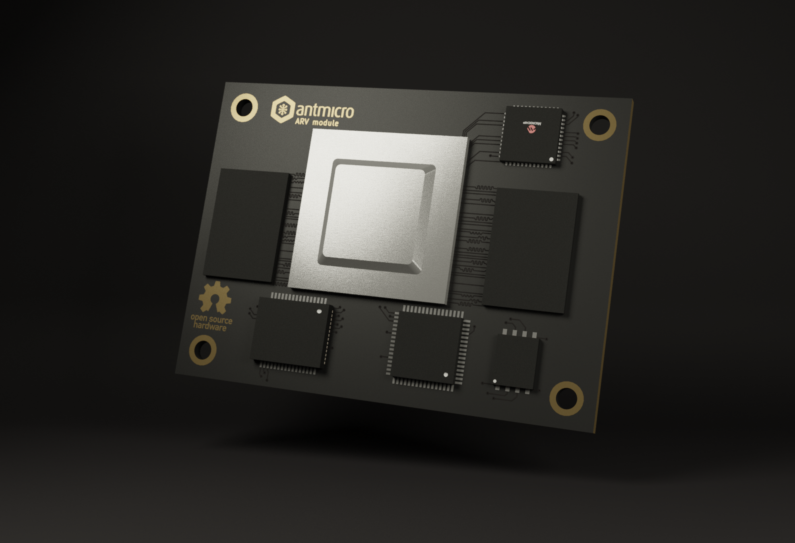

====================
ARV System on Module
====================

Copyright (c) 2021 `Antmicro <https://www.antmicro.com>`_

Overview
--------

This repository contains open hardware design files for the ARV System on Module (SoM) based on the StarFive 71x0 SoC.
The design is made in KiCad and currently in progress.

Repository structure
--------------------

The main repository directory contains KiCad PCB project files, a LICENSE and README.
The remaining files are stored in the following directories:

* ``lib`` - contains the component libraries
* ``img`` - contains graphics for this README

Key Features
------------

* StarFive 71x0 SoC (7100 in the current revision until 7110 becomes available)
* 2x DF40 board-to-board connectors for baseboard integration
* HDMI interface
* Gigabit Ethernet interface
* USB 3.0 interface
* 2x MIPI CSI-2 interface (2 lanes each)
* I2C interface
* MIPI DSI interface (4 lanes)
* SD/SDIO/eMMC interface
* 26 GPIOs
* 256Mbit QSPI NOR Flash memory
* 2x 32Gb LPDDR4 (Micron MT53D1024M32D4DT-053)

License
=======

`Apache-2.0 <LICENSE>`_
